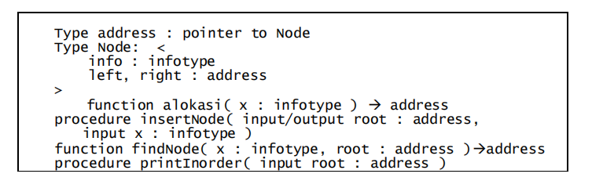
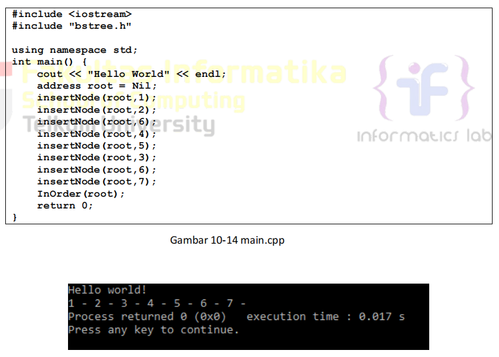
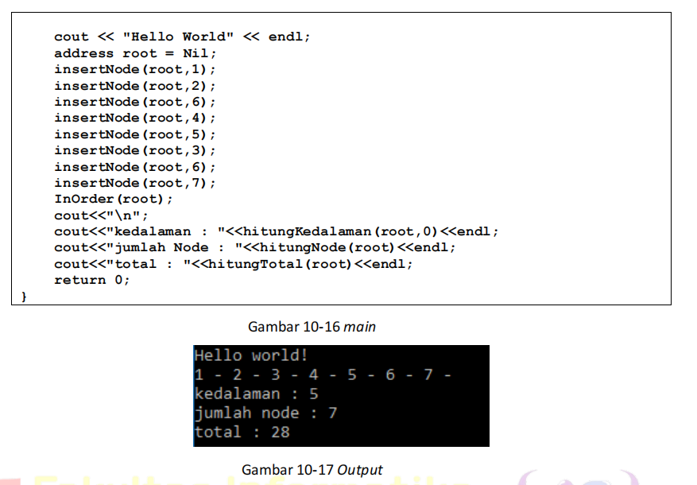
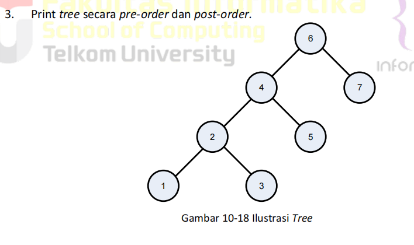

# Laporan Praktikum Modul 10 - Tree
<p align="center">Yossika Putra Erlangga - 103112430026</p>

---

## Dasar Teori

Pada Modul 10, kita mempelajari tentang **struktur data tree**, yang merupakan salah satu **struktur data non-linier** yang digunakan untuk merepresentasikan hubungan hierarkis antara elemen-elemen data. Berbeda dengan struktur data linier seperti **array** dan **linked list**, **tree** memiliki **akar** (root) dan **simpul** (node) yang membentuk cabang, sehingga membentuk struktur pohon. Tree sering digunakan dalam berbagai aplikasi komputasi seperti pencarian data, sistem file, dan algoritma pengurutan.

**Rekursif** adalah konsep dasar dalam pemrograman yang memungkinkan suatu fungsi memanggil dirinya sendiri untuk menyelesaikan sub-masalah yang lebih kecil. Fungsi rekursif banyak digunakan dalam **traversal tree**, serta berbagai algoritma yang memiliki struktur berulang, seperti perhitungan pangkat dan faktorial.

### Binary Search Tree (BST)
**Binary Search Tree (BST)** adalah jenis pohon biner di mana setiap node memiliki dua cabang: **left** dan **right**, yang berisi nilai yang lebih kecil atau lebih besar dari nilai node saat ini, sesuai dengan aturan pencarian. Keunggulan utama BST adalah kemampuannya untuk melakukan pencarian dengan efisien, dalam waktu **O(log n)** untuk operasi pencarian, penyisipan, dan penghapusan pada pohon yang seimbang.

### Traversal pada Binary Tree
Traversal adalah proses mengunjungi setiap node dalam tree dengan urutan tertentu. Ada tiga jenis traversal utama pada binary tree:
1. **Pre-order Traversal**: Kunjungi root terlebih dahulu, lalu subtree kiri, kemudian subtree kanan.
2. **In-order Traversal**: Kunjungi subtree kiri, kemudian root, lalu subtree kanan.
3. **Post-order Traversal**: Kunjungi subtree kiri, kemudian subtree kanan, dan terakhir root.

Setiap traversal memiliki kegunaan yang berbeda tergantung pada aplikasinya.

---

## Dasar Pemrograman

Pemrograman **binary tree** dalam bahasa **C++** dilakukan dengan menggunakan struktur data **node** yang memiliki dua pointer, yaitu **left** dan **right**, yang menunjuk ke sub-tree kiri dan kanan. Operasi dasar pada tree meliputi **insert** (penyisipan), **search** (pencarian), dan **traversal** (penelusuran). Rekursi digunakan untuk operasi **traversal** seperti **pre-order**, **in-order**, dan **post-order** yang mengunjungi node dalam urutan tertentu.

### Kode C++ untuk BST
Berikut adalah contoh kode **Binary Search Tree (BST)** dalam bahasa C++:
```cpp
#include <iostream>
#include "bstree.h"

using namespace std;

int main() {
    Node* root = nullptr;  // Start with an empty tree

    cout << "Hello world!" << endl;

    // Insert nodes into the tree
    insertNode(root, 6);  // Root
    insertNode(root, 4);
    insertNode(root, 7);
    insertNode(root, 2);
    insertNode(root, 5);
    insertNode(root, 1);
    insertNode(root, 3);

    // Print the tree in pre-order
    cout << "PreOrder Traversal: ";
    printPreOrder(root);
    cout << endl;

    // Print the tree in post-order
    cout << "PostOrder Traversal: ";
    printPostOrder(root);
    cout << endl;

    return 0;
}
```

### Penjelasan:
- **Pre-order Traversal**: Mengunjungi root terlebih dahulu, kemudian subtree kiri, dan terakhir subtree kanan.
- **Post-order Traversal**: Mengunjungi subtree kiri terlebih dahulu, kemudian subtree kanan, dan terakhir root.

---

## Guided 1 - Implementasi Binary Search Tree (BST) dengan C++

### BST1.h
```cpp
#ifndef QUEUE_H
#define QUEUE_H
#define Nil NULL

#include<iostream>
using namespace std;

typedef struct node *address;

struct node{
    int dataAngka;
    address next;
};

struct queue{
    address head;
    address tail;
};

bool isEmpty(queue Q);
void createQueue(queue &Q);
address alokasi(int angka);
void dealokasi(queue &node);

void enQueue(queue &Q, address nodeBaru);
void deQueue(queue &Q);
void updateQueue(queue &Q, int posisi);
void viewQueue(queue Q);
void searchData(queue Q, int angka);

#endif
```

### BST1.cpp
```cpp
#include "queue.h"
#include <iostream>
using namespace std;

bool isEmpty(queue Q){
    return Q.head == Nil;
}

void createQueue(queue &Q){
    Q.head = Q.tail = Nil;
}

address alokasi(int angka){
    address nodeBaru = new node;
    nodeBaru->dataAngka = angka;
    nodeBaru->next = Nil;
    return nodeBaru;
}

void dealokasi(address &node){
    node->next = Nil;
    delete node;
}

void enQueue(queue &Q, address nodeBaru){
    if(isEmpty(Q)){
        Q.head = Q.tail = nodeBaru;
    } else {
        Q.tail->next = nodeBaru;
        Q.tail = nodeBaru;
    }
    cout << "Node " << nodeBaru->dataAngka << " berhasil ditambahkan kedalam queue!" << endl;
}

void deQueue(queue &Q){
    if(isEmpty(Q)){
        cout << "Queue kosong!" << endl;
    } else {
        address nodeHapus = Q.head;
        Q.head = Q.head->next;
        nodeHapus->next = Nil;
        if(Q.head == Nil){
            Q.tail = Nil;
        }
        cout << "node " << nodeHapus->dataAngka << " berhasil dihapus dari queue!" << endl;
        dealokasi(nodeHapus);
    }
}

void updateQueue(queue &Q, int posisi){
    if(isEmpty(Q)){
        cout << "Queue kosong!" << endl;
    } else {
        if(posisi == 0){
            cout << "Posisi tidak valid!" << endl;
        } else {
            address nodeBantu = Q.head;
            int count = 1;
            bool found = false;
            while(nodeBantu != Nil){
                if(count < posisi){
                    nodeBantu = nodeBantu->next;
                    count++;
                } else if(count == posisi){
                    cout << "Update node posisi ke-" << posisi << endl;
                    cout << "Masukkan angka : ";
                    cin >> nodeBantu->dataAngka;
                    cout << "Data berhasil diupdate!" << endl;
                    found = true;
                    break;
                }
            }
            if(!found){
                cout << "Posisi " << posisi << " tidak valid!" << endl;
            }
        }
    }
}

void viewQueue(queue Q){
    if(isEmpty(Q)){
        cout << "Queue kosong!" << endl;
    } else {
        address nodeBantu = Q.head;
        while(nodeBantu != Nil){
            cout << nodeBantu->dataAngka << " ";
            nodeBantu = nodeBantu->next;
        }
        cout << endl;
    }
}

void searchData(queue Q, int data){
    if(isEmpty(Q)){
        cout << "Queue kosong!" << endl;
    } else {
        address nodeBantu = Q.head;
        int posisi = 1;
        bool found = false;
        cout << "Mencari data " << data << "..." << endl;
        while(nodeBantu != Nil){
            if(nodeBantu->dataAngka == data){
                cout << "Data " << data << " ditemukan pada posisi ke-" << posisi << endl;
                found = true;
                break;
            }
            posisi++;
            nodeBantu = nodeBantu->next;
        }
        if(!found){
            cout << "Data " << data << " tidak ditemukan didalam queue!" << endl;
        }
    }
}
```

### main.cpp
```cpp
#include "queue.h"
#include <iostream>
using namespace std;

int main() {
    queue Q;
    address nodeA, nodeB, nodeC, nodeD, nodeE = Nil;
    createQueue(Q);

    nodeA = alokasi(1);
    nodeB = alokasi(2);
    nodeC = alokasi(3);
    nodeD = alokasi(4);
    nodeE = alokasi(5);

    enQueue(Q, nodeA);
    enQueue(Q, nodeB);
    enQueue(Q, nodeC);
    enQueue(Q, nodeD);
    enQueue(Q, nodeE);
    cout << endl;

    cout << "--- Queue setelah enqueue ---" << endl;
    viewQueue(Q);
    cout << endl;

    deQueue(Q);
    deQueue(Q);
    cout << endl;

    cout << "--- Queue setelah dequeue 2 kali ---" << endl;
    viewQueue(Q);
    cout << endl;

    updateQueue(Q, 2);
    updateQueue(Q, 1);
    updateQueue(Q, 4);
    cout << endl;

    cout << "--- Queue setelah update ---" << endl;
    viewQueue(Q);
    cout << endl;

    searchData(Q, 4);
    searchData(Q, 9);

    return 0;
}
```


### Penjelasan:
Pada **Guided 1**, kita mengimplementasikan **Binary Search Tree (BST)** menggunakan struktur **linked list**. BST adalah jenis pohon biner di mana setiap node memiliki dua cabang: **left** dan **right**, yang berisi nilai yang lebih kecil atau lebih besar dari nilai node saat ini, sesuai dengan aturan pencarian. Fungsi **insertNode** digunakan untuk menambahkan node baru, dan **preOrder**, **inOrder**, serta **postOrder** digunakan untuk traversal tree.

---

## Guided 2 - Implementasi Binary Search Tree (BST) dengan Pencarian dan Penghapusan

### BST2.h
```cpp
#ifndef BST1_H
#define BST1_H

#include <iostream>

using namespace std;
typedef int infotype;

typedef struct Node* address;
struct Node {
    infotype info;
    address left;
    address right;
};
bool isEmpty(address root);
void createTree(address &root);
address newNode(infotype x);
address insertNode(address root, infotype x);
void preOrder(address root);
void inOrder(address root);
void postOrder(address root);
int countNodes(address root);
int treeDepth(address root);
void searchByData(address root, infotype x);
address mostLeft(address root);
address mostRight(address root);
bool deleteNode(address &root, infotype x);
void deleteTree(address &root);
#endif
```

### BST2.cpp
```cpp
#include "BST2.h"
#include <iostream>

using namespace std;

//FUNCTION & PROSEDUR SEBELUMNYA
//isEmpty & createTree
bool isEmpty(address root) { //function untuk mengecek apakah BST kosong atau tidak
    if(root == NULL){
        return true;
    } else {
        return false;
    }
}

void createTree(address &root) { //function untuk membuat BST nya (root di-set sebagai NULL)
    root = NULL;
}


//alokasi & insert
address newNode(infotype x) { //function untuk memasukkan data (infotype) kedalam node
    address temp = new Node;
    temp->info = x;
    temp->left = NULL;
    temp->right = NULL;
    return temp;
}

address insertNode(address root, infotype x) { //function untuk memasukkan node kedalam BST
    if (root == NULL) {
        return newNode(x);
    }

    if (x < root->info) {
        root->left = insertNode(root->left, x);
    } else if (x > root->info) {
        root->right = insertNode(root->right, x);
    }

    return root;
}


//Traversal
void preOrder(address root) { //function traversal tree secara pre-order (tengah - kiri - kanan atau root - child kiri - child kanan)
    if (root != NULL) {
        cout << root->info << " ";
        preOrder(root->left);
        preOrder(root->right);
    }
}

void inOrder(address root) { //function traversal tree secara in-order (kiri - tengah - kanan atau child kiri - root - child kanan)
    if (root != NULL) {
        inOrder(root->left);
        cout << root->info << " ";
        inOrder(root->right);
    }
}

void postOrder(address root) { //function traversal tree secara post-order (kiri - kanan - tengah atau child kiri - child kanan - root)
    if (root != NULL) {
        postOrder(root->left);
        postOrder(root->right);
        cout << root->info << " ";
    }
}


//Utilities
int countNodes(address root) { //function untuk menghitung size atau ukuran atau jumlah node yang ada didalam tree
    if (isEmpty(root) == true) {
        return 0;
    } else {
        return 1 + countNodes(root->left) + countNodes(root->right);
    }
}

int treeDepth(address root) { //function untuk menghitung height atau kedalaman atau level tree
    if (isEmpty(root) == true) {
        return -1; //tree kosong jika depth = -1
    } else {
        int leftDepth = treeDepth(root->left);
        int rightDepth = treeDepth(root->right);
    
        return (leftDepth > rightDepth ? leftDepth : rightDepth) + 1;
    }
}


//FUNCTION & PROSEDUR BARU
//searching
void searchByData(address root, infotype x) { //function untuk melakukan searching data tertentu
    if(isEmpty(root) == true){
        cout << "BST kosong!" << endl;
    } else {
        address nodeBantu = root;
        address parent = NULL;
        bool ketemu = false;
        while(nodeBantu != NULL){
            if(x < nodeBantu->info){
                parent = nodeBantu;
                nodeBantu = nodeBantu->left;
            } else if(x > nodeBantu->info){
                parent = nodeBantu;
                nodeBantu = nodeBantu->right;
            } else if(x == nodeBantu->info){
                ketemu = true;
                break;
            }
        }
        if(ketemu == false){
            cout << "Data tidak ditemukan" << endl;
        } else if(ketemu == true){
            cout << "Data ditemukan didalam BST!" << endl;
            cout << "Data Angka : " << nodeBantu->info << endl;

            //menampilkan parentnya & pengecekan sibling
            address sibling = NULL;
            if(parent != NULL){
                cout << "Parent : " << parent->info << endl;
                if(parent->left == nodeBantu){
                    sibling = parent->right;
                } else if(parent->right == nodeBantu){
                    sibling = parent->left;
                }
            } else {
                cout << "Parent : - (node root)"<< endl;
            }

            //menampilkan siblingnya
            if(sibling != NULL){
                cout << "Sibling : " << sibling->info << endl;
            } else {
                cout << "Sibling : - " << endl;
            }

            //menampilkan childnya
            if(nodeBantu->left != NULL){
                cout << "Child kiri : " << nodeBantu->left->info << endl;
            } else if(nodeBantu->left == NULL){
                cout << "Child kiri : -" << endl;
            }
            if(nodeBantu->right != NULL){
                cout << "Child kanan : " << nodeBantu->right->info << endl;
            } else if(nodeBantu->right == NULL){
                cout << "Child kanan : -" << endl;
            }
        }
    }
}


//mostleft & mostright
address mostLeft(address root) { //function untuk menampilkan mostleft atau node paling kiri (node dengan nilai terkecil) didalam BST
    while (root->left != NULL){
        root = root->left;
    }
    return root;
}

address mostRight(address root) { //function untuk menampilkan mostright atau node paling kanan (node dengan nilai terbesar) didalam BST
    while (root->right != NULL){
        root = root->right;
    }
    return root;
}


//delete
bool deleteNode(address &root, infotype x) { //function untuk menghapus node tertentu didalam BST (menghapus berdasarkan parameter infotype)
    if (root == NULL) {
        return false; //data tidak ditemukan di subtree ini
    } else {
        if (x < root->info) {
            return deleteNode(root->left, x);
        } else if (x > root->info) {
            return deleteNode(root->right, x);
        } else {
            //jika node yang mau dihapus ditemukan
            //Case 1 : node yang mau dihapus adalah leaf
            if (root->left == NULL && root->right == NULL) {
                address temp = root;
                root = NULL;
                delete temp;
            }
            //Case 2 : node yang mau dihapus hanya punya right child
            else if (root->left == NULL) {
                address temp = root;
                root = root->right;
                delete temp;
            }
            //Case 3 : node yang mau dihapus hanya punya left child
            else if (root->right == NULL) {
                address temp = root;
                root = root->left;
                delete temp;
            }
            // Case 4 : jika node yang mau dihapus punya dua child, maka ambil mostleft dari subtree kanan untuk menggantikan node yang mau dihapus
            else {
                //mostleft dari subtree kanan = node successor (node penerus)
                address successor = mostLeft(root->right);
                //salin data successor ke node saat ini
                root->info = successor->info;
                //hapus successor pada subtree kanan
                return deleteNode(root->right, successor->info);
            }
            return true; //berhasil dihapus
        }
    }
}

void deleteTree(address &root) { //prosedur untuk menghapus BST (menghapus seluruh node BST)
    if(root == NULL){
        return;
    } else {
        deleteTree(root->left);
        deleteTree(root->right);
        delete root;
        root = NULL;
    }
}
```

### main.cpp
```cpp
#include <iostream>
#include "BST2.h"

using namespace std;

int main(){
    address root;
    createTree(root);

    cout << "=== Binary Search Tree ==" << endl;
    cout << endl;

    root = insertNode(root, 30); 

    insertNode(root, 15);
    insertNode(root, 35);
    insertNode(root, 11);
    insertNode(root, 17);
    insertNode(root, 20);
    insertNode(root, 38);
    insertNode(root, 16);
    insertNode(root, 22);
    insertNode(root, 33);
    insertNode(root, 18);

    cout << "Hasil InOrder Traversal : ";
    inOrder(root);
    cout << endl;

    cout << endl;
    cout << "Jumlah Node : " << countNodes(root) << endl;
    cout << "Kedalaman Tree : " << treeDepth(root) << endl;

    cout << endl;
    searchByData(root, 17);
    
    cout << endl;
    cout << "Node mostleft : " << mostLeft(root)->info << endl;
    cout << "Node mostright : " << mostRight(root)->info << endl;

    cout << endl;
    infotype angkaHapus;
    cout << "Masukkan angka yang ingin dihapus: ";
    cin >> angkaHapus;
  
    if(deleteNode(root, angkaHapus)){
        cout << "Data " << angkaHapus << " berhasil dihapus!" << endl;
    } else {
        cout << "Data " << angkaHapus << " tidak ditemukan!" << endl;
    }
    cout << endl;

    searchByData(root, 17);
    cout << endl;
    searchByData(root, 18);

    cout << endl;
    cout << "Hasil InOrder Traversal : ";
    inOrder(root);
    cout << endl;

    cout << endl;
    deleteTree(root);
    cout << "Seluruh tree berhasil dihapus!" << endl;

    cout << endl;
    if(isEmpty(root) == true){
        cout << "BST kosong!" << endl;
    } else {
        cout << "Hasil InOrder Traversal : ";
        inOrder(root);
    }

    return 0;
}
```

### Penjelasan:
Pada **Guided 2**, kita mengembangkan implementasi **Binary Search Tree (BST)** dengan menambahkan kemampuan **pencarian**, **penghapusan**, serta **fungsi untuk mencari node paling kiri (most-left)** dan paling kanan (most-right). Fungsi **searchByData** digunakan untuk mencari elemen tertentu dalam BST, dan **deleteNode** digunakan untuk menghapus node dalam tree dengan berbagai kemungkinan kasus (misalnya jika node memiliki dua anak).


---
## Unguided 1 - Binary Search Tree (BST) dengan Linked List

1. Buatlah ADT Binary Search Tree menggunakan Linked list sebagai berikut di dalam file
	“bstree.h”:



Buatlah implementasi ADT Binary Search Tree pada file “bstree.cpp” dan cobalah hasil
implementasi ADT pada file “main.cpp”


### bstree.h
```cpp
#ifndef BSTREE_H
#define BSTREE_H

#include <iostream>
using namespace std;

typedef int infotype; 

struct Node {
    infotype info;
    Node* left;
    Node* right;
};

Node* alokasi(infotype x);
void insertNode(Node*& root, infotype x);
void findNode(Node* root, infotype x);
void printInOrder(Node* root);
bool isEmpty(Node* root);

#endif

```

### bstree.cpp
```cpp
#include "bstree.h"

Node* alokasi(infotype x) {
    Node* newNode = new Node;
    newNode->info = x;
    newNode->left = nullptr;
    newNode->right = nullptr;
    return newNode;
}

void insertNode(Node*& root, infotype x) {
    if (root == nullptr) {
        root = alokasi(x);  
    } else if (x < root->info) {
        insertNode(root->left, x); 
    } else if (x > root->info) {
        insertNode(root->right, x);  
    }
}

void findNode(Node* root, infotype x) {
    if (root == nullptr) {
        cout << "Data " << x << " tidak ditemukan." << endl;
    } else if (x < root->info) {
        findNode(root->left, x);  
    } else if (x > root->info) {
        findNode(root->right, x);  
    } else {
        cout << "Data " << x << " ditemukan." << endl;
    }
}

void printInOrder(Node* root) {
    if (root != nullptr) {
        printInOrder(root->left);  
        cout << root->info << " - ";  
        printInOrder(root->right); 
    }
}


bool isEmpty(Node* root) {
    return root == nullptr;
}

```

### main.cpp
```cpp
#include <iostream>
#include "bstree.h"

using namespace std;

int main() {
    Node* root = nullptr;  

    cout << "Hello world!" << endl;

    insertNode(root, 1);
    insertNode(root, 2);
    insertNode(root, 3);
    insertNode(root, 4);
    insertNode(root, 5);
    insertNode(root, 6);
    insertNode(root, 7);

    printInOrder(root);
    cout << endl;  

    return 0;
}

```

### Output Unguided 1 :

##### Output 1


### Penjelasan:
Pada **Unguided 1**, kita diminta untuk mengimplementasikan **Binary Search Tree (BST)** menggunakan **linked list**. Dalam implementasi ini, setiap node memiliki dua pointer, yaitu **left** dan **right**, yang menunjuk ke anak kiri dan anak kanan.
### Penjelasan:
- **InOrder Traversal**: Node dicetak dalam urutan **ascending** karena kita menggunakan **in-order traversal** pada **Binary Search Tree (BST)**.
- **Kedalaman**: Kedalaman maksimal dari tree dihitung dengan mengukur jarak dari root hingga node terdalam.
- **Jumlah Node**: Total node dalam tree adalah 7.
- **Total**: Jumlah semua nilai dalam tree adalah 28.

---
## Unguided 2 - Binary Search Tree dengan Fitur Pencarian dan Penghapusan

Buatlah fungsi untuk menghitung jumlah node dengan fungsi berikut.

➢ fungsi hitungJumlahNode( root:address ) : integer
/* fungsi mengembalikan integer banyak node yang ada di dalam BST*/

➢ fungsi hitungTotalInfo( root:address, start:integer ) : integer
/* fungsi mengembalikan jumlah (total) info dari node-node yang ada di dalam BST*/

➢ fungsi hitungKedalaman( root:address, start:integer ) : integer
/* fungsi rekursif mengembalikan integer kedalaman maksimal dari binary tree */



### bstree.h
```cpp
#ifndef BSTREE_H
#define BSTREE_H

typedef int infotype;

struct Node {
    infotype info;
    Node* left;
    Node* right;
};

typedef Node* address;

address alokasi(infotype x);
void insertNode(address &root, infotype x);
void InOrder(address root);

int hitungNode(address root);
int hitungTotal(address root);
int hitungKedalaman(address root, int start);

#endif


```

### bstree.cpp
```cpp
#include <iostream>
#include "bstree.h"
using namespace std;

address alokasi(infotype x) {
    address p = new Node;
    p->info = x;
    p->left = NULL;
    p->right = NULL;
    return p;
}

void insertNode(address &root, infotype x) {
    if (root == NULL) {
        root = alokasi(x);
    }
    else if (x < root->info) {
        insertNode(root->left, x);
    }
    else if (x > root->info) {
        insertNode(root->right, x);
    }
}

void InOrder(address root) {
    if (root != NULL) {
        InOrder(root->left);
        cout << root->info << " - ";
        InOrder(root->right);
    }
}

int hitungNode(address root) {
    if (root == NULL) return 0;
    return 1 + hitungNode(root->left) + hitungNode(root->right);
}

int hitungTotal(address root) {
    if (root == NULL) return 0;
    return root->info + hitungTotal(root->left) + hitungTotal(root->right);
}

int hitungKedalaman(address root, int start) {
    if (root == NULL) return start - 1;  
    int kiri = hitungKedalaman(root->left, start + 1);
    int kanan = hitungKedalaman(root->right, start + 1);
    return (kiri > kanan ? kiri : kanan);
}


```

### main.cpp
```cpp
#include <iostream>
#include "bstree.h"
using namespace std;

int main() {
    cout << "Hello world!" << endl;

    address root = NULL;

    insertNode(root, 1);
    insertNode(root, 2);
    insertNode(root, 6);
    insertNode(root, 4);
    insertNode(root, 5);
    insertNode(root, 3);
    insertNode(root, 6);   
    insertNode(root, 7);

    InOrder(root);
    cout << endl;

    cout << "kedalaman : " << hitungKedalaman(root, 1) << endl;
    cout << "jumlah node : " << hitungNode(root) << endl;
    cout << "total : " << hitungTotal(root) << endl;

    return 0;
}

```

### Output Unguided 2 :

##### Output 1

### Penjelasan:
Pada **Unguided 2**, kita mengembangkan implementasi **Binary Search Tree (BST)** dengan menambahkan fitur **pencarian** dan **penghapusan**. Fungsi **searchByData** digunakan untuk mencari elemen tertentu dalam tree, sedangkan **deleteNode** digunakan untuk menghapus node dengan menangani berbagai kasus.

---

## Unguided 3 - Binary Search Tree dengan Pre-order dan Post-order


### bstree.h
```cpp
#ifndef BSTREE_H
#define BSTREE_H

#include <iostream>
using namespace std;

typedef int infotype;  

struct Node {
    infotype info;
    Node* left;
    Node* right;
};

Node* alokasi(infotype x);
void insertNode(Node*& root, infotype x);
void printPreOrder(Node* root);
void printPostOrder(Node* root);
void printInOrder(Node* root);
bool isEmpty(Node* root);

#endif


```

### bstree.cpp
```cpp
#include "bstree.h"

Node* alokasi(infotype x) {
    Node* newNode = new Node;
    newNode->info = x;
    newNode->left = nullptr;
    newNode->right = nullptr;
    return newNode;
}

void insertNode(Node*& root, infotype x) {
    if (root == nullptr) {
        root = alokasi(x);  
    } else if (x < root->info) {
        insertNode(root->left, x);  
    } else if (x > root->info) {
        insertNode(root->right, x); 
    }
}

void printPreOrder(Node* root) {
    if (root != nullptr) {
        cout << root->info << " ";
        printPreOrder(root->left); 
        printPreOrder(root->right); 
    }
}

void printPostOrder(Node* root) {
    if (root != nullptr) {
        printPostOrder(root->left);  
        printPostOrder(root->right);  
        cout << root->info << " ";  
    }
}

bool isEmpty(Node* root) {
    return root == nullptr;
}


```

### main.cpp
```cpp
#include <iostream>
#include "bstree.h"

using namespace std;

int main() {
    Node* root = nullptr;  

    cout << "Hello world!" << endl;

    insertNode(root, 6);  
    insertNode(root, 4);
    insertNode(root, 7);
    insertNode(root, 2);
    insertNode(root, 5);
    insertNode(root, 1);
    insertNode(root, 3);

    cout << "PreOrder: ";
    printPreOrder(root);
    cout << endl;

    cout << "PostOrder: ";
    printPostOrder(root);
    cout << endl;

    return 0;
}


```

### Output Unguided 3 :

##### Output 1


### Penjelasan:
Pada **Unguided 3**, kita diminta untuk mencetak **Binary Search Tree** secara **pre-order** dan **post-order**. **Pre-order traversal** mengunjungi root terlebih dahulu, kemudian subtree kiri, dan terakhir subtree kanan. **Post-order traversal** mengunjungi subtree kiri terlebih dahulu, kemudian subtree kanan, dan terakhir root.

---

## Kesimpulan

Pada praktikum Modul 10 ini, kita mempelajari implementasi **Binary Search Tree (BST)** dan konsep dasar **rekursi** dalam pemrograman. Kami juga mengimplementasikan berbagai operasi pada tree, seperti **pencarian**, **penyisipan**, **penghapusan**, serta berbagai jenis **traversal** (pre-order, in-order, post-order). Dari implementasi **Unguided 1, 2, dan 3**, kami juga memahami cara menghitung **jumlah node**, **total informasi** di dalam tree, serta **kedalaman maksimal**. Secara keseluruhan, pemahama...

---

## Referensi

1. Goodrich, M., Tamassia, R., Goldwasser, M. (2014). *Data Structures & Algorithms in C++*. Wiley.
2. Malik, D. S. (2018). *Data Structures Using C++*. Cengage Learning.
3. Modul Praktikum Struktur Data. **Modul 10 – Tree**, Telkom University, 2025.
4. GeeksforGeeks (2024). *Queue Data Structure Overview*.
5. Kurniawan, A. (2021). *Struktur Data dalam Bahasa C++*. Informatika Bandung.
6. Sharma, A., & Singh, P. (2020). "Analysis of Queue Data Structures in System Simulation", *International Journal of Computer Applications*.
7. Stallings, W. (2018). *Operating Systems: Internals and Design Principles*. Pearson.
8. Wikipedia. (2024). *Binary Search Tree*. [https://en.wikipedia.org/wiki/Binary_search_tree](https://en.wikipedia.org/wiki/Binary_search_tree)
