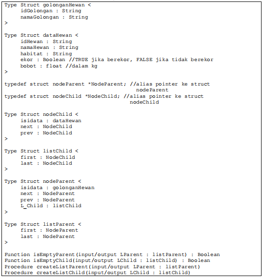
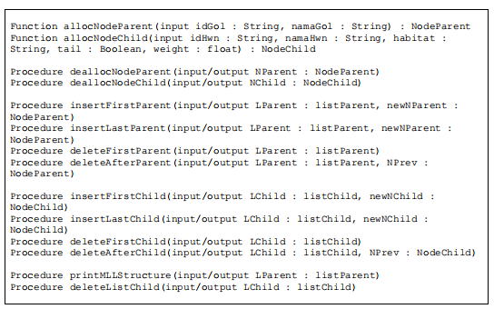
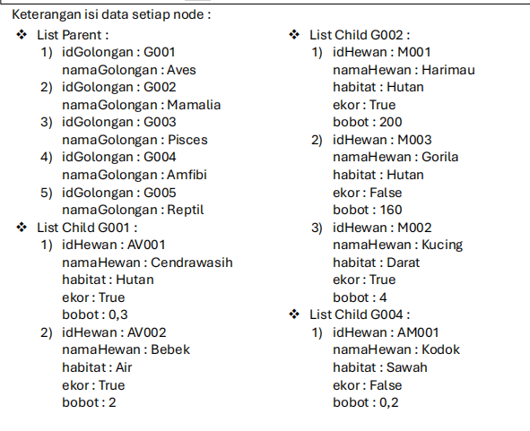
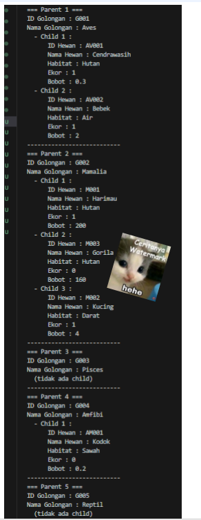
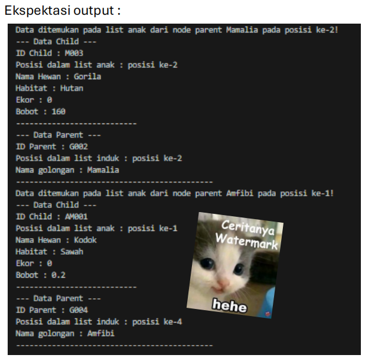
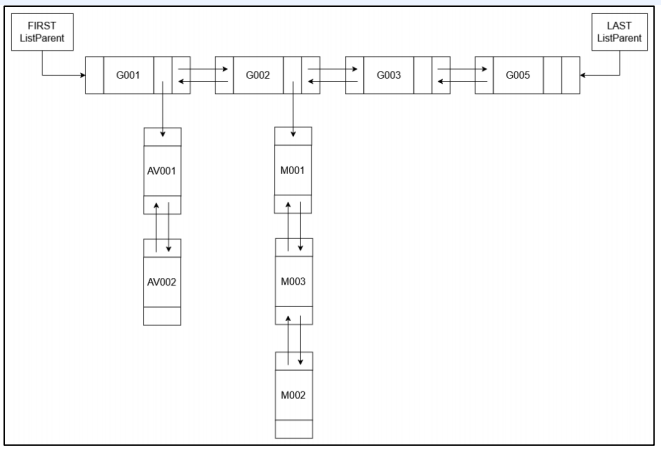
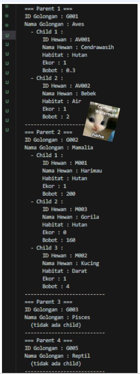

# Laporan Praktikum Modul 13 - Multi Linked List
<p align="center">Yossika Putra Erlangga - 103112430026</p>

---

## **Dasar Teori**

Pada praktikum **Modul 13**, kita akan mempelajari tentang **Multi Linked List**. **Multi Linked List** adalah struktur data yang terdiri dari beberapa list yang memiliki keterhubungan satu sama lain. Setiap elemen dalam Multi Linked List dapat membentuk list tersendiri, dengan beberapa list yang berfungsi sebagai **list induk** dan **list anak**.

### **Definisi Multi Linked List**
Multi Linked List merupakan sekumpulan list yang memiliki hubungan satu sama lain. Setiap list dalam Multi Linked List dapat memiliki list lain di dalamnya, yang disebut **list anak**. Biasanya, **list induk** akan mengarah kepada **list anak**, yang memungkinkan hubungan hierarkis antara data.

---

## **Dasar Pemrograman**

### **Pengenalan Multi Linked List dalam Pemrograman**
Pada **Multi Linked List**, setiap elemen **list anak** memiliki pointer yang menunjuk ke elemen berikutnya dalam list anak yang sama, sedangkan **list induk** memiliki pointer yang mengarah ke **list anak** tertentu.

Struktur data ini sering digunakan dalam aplikasi yang membutuhkan hubungan banyak-ke-banyak, seperti pengorganisasian data pegawai dan anak, atau data yang memiliki banyak kategori.

### **Operasi Dasar dalam Multi Linked List**
Beberapa operasi yang akan dipelajari dalam praktik ini antara lain:
1. **Insert Anak**: Menambahkan elemen anak pada list anak.
2. **Insert Induk**: Menambahkan elemen induk pada list induk.
3. **Delete Anak**: Menghapus elemen anak.
4. **Delete Induk**: Menghapus elemen induk beserta elemen anak yang terkait.

### **Contoh Kode untuk Insert Anak**
```cpp
void insertLastAnak(listanak &Lanak, address_anak P) {
    address_anak Q = Lanak.first;
    while (Q != NULL) {
        Q = Q->next;
    }
    if (Q == NULL) {
        Lanak.first = P;
    } else {
        Q->next = P;
    }
    P->prev = Q;
    P->next = NULL;
}
```

Pada kode di atas, fungsi `insertLastAnak` digunakan untuk menambahkan elemen anak pada akhir list anak. Fungsi ini akan mencari posisi terakhir dalam list anak dan menambahkannya di sana.

---

## Guided 1 - Implementasi Multilist

### multilist.h
```cpp
#ifndef MULTILIST_H
#define MULTILIST_H

#include <vector>
#include <string>
using namespace std;

typedef struct nodeParent *NodeParent;
typedef struct nodeChild *NodeChild;

struct nodeChild{
    string idMakanan;
    string namaMakanan;
    NodeChild next;
    NodeChild prev;
};
struct listAnak{
    NodeChild first;
    NodeChild last;
};
struct nodeParent{
    string idKategoriMakanan;
    string namaKategoriMakanan;
    listAnak daftarMakanan;
    NodeParent next;
    NodeParent prev;
    listAnak L_Anak ;
};
struct listInduk{
    NodeParent first;
    NodeParent last;
};
void createListInduk(listInduk &LInduk);
void createListAnak(listAnak &LAnak);

NodeParent alokasiNodeParent(string idKategoriMakanan, string namaKategoriMakanan);
void dealokasiNodeParent(NodeParent &nodeInduk);
NodeChild alokasiNodeChild(string idMakanan, string namaMakanan);
void dealokasiNodeChild(NodeChild &nodeAnak);
void insertLastParent(listInduk &LInduk, NodeParent nodeBaruParent);
void hapusListAnak(listAnak &LAnak);
void deleteAfterParent(listInduk &LInduk, NodeParent nodePrev);
void insertLastChild(listAnak &LAnak, NodeChild nodeBaruChild);
void deleteAfterChild(listAnak &LAnak, NodeChild nodePrev);
void findChildByID(listInduk &LInduk, string IDCari);
void printStrukturMLL(listInduk &LInduk);

#endif

```

### multilist.cpp
```cpp
#include "multilist.h"
#include <iostream>

using namespace std;

void createListInduk(listInduk &LInduk){
    LInduk.first = LInduk.last = NULL;
}

void createListAnak(listAnak &LAnak){
    LAnak.first = LAnak.last = NULL;
}

NodeParent alokasiNodeParent(string idKategoriMakanan, string namaKategoriMakanan){
    NodeParent nodeBaruParent = new nodeParent;
    nodeBaruParent->idKategoriMakanan = idKategoriMakanan;
    nodeBaruParent->namaKategoriMakanan = namaKategoriMakanan;
    nodeBaruParent->next = NULL;
    nodeBaruParent->prev = NULL;
    createListAnak(nodeBaruParent->L_Anak);
    return nodeBaruParent;
}

void dealokasiNodeParent(NodeParent &nodeInduk){
    if(nodeInduk != NULL) {
        nodeInduk->next = nodeInduk->prev = NULL;
        delete nodeInduk;
        nodeInduk = NULL;
    }
}

NodeChild alokasiNodeChild(string idMakanan, string namaMakanan){
    NodeChild nodeBaruChild = new nodeChild;
    nodeBaruChild->idMakanan = idMakanan;
    nodeBaruChild->namaMakanan = namaMakanan;
    nodeBaruChild->next = NULL;
    nodeBaruChild->prev = NULL;
    return nodeBaruChild;
}

void dealokasiNodeChild(NodeChild &nodeAnak){
    if(nodeAnak != NULL) {
        nodeAnak->next = nodeAnak->prev = NULL;
        delete nodeAnak;
        nodeAnak = NULL;
    }
}

void insertLastParent(listInduk &LInduk, NodeParent nodeBaruParent){
    if(LInduk.first == NULL) {
        LInduk.first = LInduk.last = nodeBaruParent;
    } else {
        nodeBaruParent->prev = LInduk.last;
        LInduk.last->next = nodeBaruParent;
        LInduk.last = nodeBaruParent;
    }
    cout << "Node parent "<< nodeBaruParent->namaKategoriMakanan << " berhasil ditambahkan kedalam urutan terakhir di list Induk!" << endl;
}

void hapusListAnak(listAnak &LAnak){
    NodeChild nodeBantu = LAnak.first;
    while(nodeBantu != NULL) {
        NodeChild nodeHapus = nodeBantu;
        nodeBantu = nodeBantu->next;
        dealokasiNodeChild(nodeHapus);
    }
    LAnak.first = LAnak.last = NULL;
}

void deleteAfterParent(listInduk &LInduk, NodeParent nodePrev){
    if(LInduk.first == NULL){
        cout << "List induk kosong!" << endl;
    } else {
        if(nodePrev != NULL && nodePrev->next != NULL){
            NodeParent nodeHapus = nodePrev->next;
            nodePrev->next = nodeHapus->next;
            if (nodeHapus->next != NULL){
                (nodeHapus->next)->prev = nodePrev;
            } else {
                LInduk.last = nodePrev;
            }
            nodeHapus->next = NULL;
            if(nodeHapus->L_Anak.first != NULL){
                hapusListAnak(nodeHapus->L_Anak);
            }
            dealokasiNodeParent(nodeHapus);
            cout << "Node parent setelah node " << nodePrev->namaKategoriMakanan << " berhasil dihapus beserta anak-anaknya!" << endl;
        } else {
            cout << "Node prev tidak valid!" << endl;
        }
    }
}

void insertLastChild(listAnak &LAnak, NodeChild nodeBaruChild){
    if(LAnak.first == NULL) {
        LAnak.first = LAnak.last = nodeBaruChild;
    } else {
        nodeBaruChild->prev = LAnak.last;
        LAnak.last->next = nodeBaruChild;
        LAnak.last = nodeBaruChild;
    }
    cout << "Node child "<< nodeBaruChild->namaMakanan << " berhasil ditambahkan kedalam urutan terakhir di list Anak!" << endl;
}

void deleteAfterChild(listAnak &LAnak, NodeChild nodePrev){
    if(LAnak.first == NULL){
        cout << "List anak kosong!" << endl;
    } else {
        if(nodePrev != NULL && nodePrev->next != NULL){
            NodeChild nodeHapus = nodePrev->next;
            nodePrev->next = nodeHapus->next;
            if (nodeHapus->next != NULL){
                (nodeHapus->next)->prev = nodePrev;
            } else {
                LAnak.last = nodePrev;
            }
            nodeHapus->next = NULL;
            dealokasiNodeChild(nodeHapus);
            cout << "Node child setelah node " << nodePrev->namaMakanan << " berhasil dihapus!" << endl;
        } else {
            cout << "Node prev tidak valid!" << endl;
        }
    }
}
void findChildByID(listInduk &LInduk, string IDCari){
    if(LInduk.first == NULL){
        cout << "List induk kosong!" << endl;
    } else {
        NodeParent nodeBantuParent = LInduk.first;
        int indexParent = 1;
        int ketemu = false;
        while(nodeBantuParent != NULL){
            NodeChild nodeBantuChild = nodeBantuParent->L_Anak.first;
            int indexChild = 1;
            while(nodeBantuChild != NULL){
                if(nodeBantuChild->idMakanan == IDCari) {
                    cout << "Data ID child ditemukan pada list anak dari node parent " << nodeBantuParent->namaKategoriMakanan << " pada posisi ke-" << indexChild << "!" << endl;
                    cout << "--- Data Child ---" << endl;
                    cout << "ID Child (ID Makanan) : " << nodeBantuChild->idMakanan << endl;
                    cout << "Posisi dalam list anak : posisi ke-" << indexChild << endl;
                    cout << "Nama Makanan : " << nodeBantuChild->namaMakanan << endl;
                    cout << "---------------------------" << endl;
                    cout << "--- Data Parent ---" << endl;
                    cout << "ID Parent (ID Kategori Makanan): " << nodeBantuParent->idKategoriMakanan << endl;
                    cout << "Posisi dalam list induk : posisi ke-" << indexParent << endl;
                    cout << "Nama Kategori Makanan : " << nodeBantuParent->namaKategoriMakanan << endl;
                    ketemu = true;
                    break;
                } else {
                    nodeBantuChild = nodeBantuChild->next;
                    indexChild++;
                }
            }
            if(ketemu){
                break;
            } else {
                nodeBantuParent = nodeBantuParent->next;
                indexParent++;
            }
        }
        if(!ketemu){
            cout << "Data ID child tidak ditemukan didalam list anak!" << endl;
        }
    }
}

void printStrukturMLL(listInduk &LInduk){
    if(LInduk.first == NULL) {
        cout << "List induk kosong!" << endl;
    } else {
        NodeParent nodeBantuParent = LInduk.first;
        int indexParent = 1;
        while(nodeBantuParent != NULL) {
            cout << "=== Parent " << indexParent << " ===" << endl;
            cout << "ID Kategori Makanan : " << nodeBantuParent->idKategoriMakanan << endl;
            cout << "Nama Kategori Makanan : " << nodeBantuParent->namaKategoriMakanan << endl;

        
            NodeChild nodeBantuChild = nodeBantuParent->L_Anak.first;
            if(nodeBantuChild == NULL) {
                cout << "  (tidak ada child)" << endl;
            } else {
                int indexChild = 1;
                while(nodeBantuChild != NULL) {
                    cout << "  - Child " << indexChild << " :" << endl;
                    cout << "      ID Makanan : " << nodeBantuChild->idMakanan << endl;
                    cout << "      Nama Makanan : " << nodeBantuChild->namaMakanan << endl;
                    nodeBantuChild = nodeBantuChild->next;
                    indexChild++;
                }
            }
            cout << "---------------------------" << endl;
            nodeBantuParent = nodeBantuParent->next;
            indexParent++;
        }
    }
}

```

### main.cpp
```cpp
#include "multilist.h"
#include <iostream>

using namespace std;

int main(){
    listInduk LInduk;
    createListInduk(LInduk);

    NodeParent K01 = alokasiNodeParent("K01", "Makanan Berat");
    insertLastParent(LInduk, K01);
    NodeParent K02 = alokasiNodeParent("K02", "Minuman");
    insertLastParent(LInduk, K02);
    NodeParent K03 = alokasiNodeParent("K03", "Dessert");
    insertLastParent(LInduk, K03);
    cout << endl ;

    NodeChild M01 = alokasiNodeChild("M001", "Nasi Goreng");
    insertLastChild(K01->L_Anak, M01);
    NodeChild M02 = alokasiNodeChild("M002", "Ayam Bakar Madu");
    insertLastChild(K01->L_Anak, M02);
    NodeChild D02 = alokasiNodeChild("D02", "Jus Alpukat");
    insertLastChild(K02->L_Anak, D02);
    NodeChild D01 = alokasiNodeChild("D01", "Es Teh Manis");
    insertLastChild(K02->L_Anak, D01);
    NodeChild S01 = alokasiNodeChild("S01", "Pudding Coklat");
    insertLastChild(K03->L_Anak, S01);
    cout << endl ;

    printStrukturMLL(LInduk);
    cout << endl ;

    findChildByID(LInduk, "D01");
    cout << endl ;
    deleteAfterChild(K01->L_Anak, M01);
    cout << endl ;
    deleteAfterParent(LInduk, K02);
    cout << endl ;  
    printStrukturMLL(LInduk);
    cout << endl ;
    return 0;
}
```


### Penjelasan:
Program di atas adalah implementasi struktur data *multilist* yang terdiri dari dua tingkat, yaitu daftar induk (*parent list*) dan daftar anak (*child list*). Setiap elemen di dalam daftar induk mewakili kategori makanan, seperti "Makanan Berat", "Minuman", dan "Dessert", yang masing-masing dapat memiliki beberapa item makanan sebagai elemen dalam daftar anak yang terkait. Struktur ini memungkinkan penyimpanan dan pengelolaan data secara terstruktur, dengan operasi seperti penambahan kategori dan item makanan, penghapusan elemen, pencarian item berdasarkan ID, serta pencetakan seluruh struktur daftar. Setiap elemen dalam daftar induk dan anak dihubungkan menggunakan pointer untuk membentuk hubungan antar kategori dan makanan. Fungsi alokasi dan dealokasi digunakan untuk memastikan pengelolaan memori yang efisien, dengan setiap node yang tidak lagi digunakan dibersihkan dari memori. Program ini memungkinkan fleksibilitas dalam mengelola data kategori makanan dan item makanan yang saling terkait.


# **Unguided**
## Unguided 1 - Binary Search Tree (BST) dengan MultilinkedList

1. Buatlah ADT Multi Linked List sebagai berikut didalam file “MultiLL.h” :




Setelah melakukan INSERT, lakukan operasi PRINT dengan memanggil prosedur 
printMLLStructure().
(Lampirkan screenshot output hasil print pada laporan)
Ekspektasi output :


### MultiLL.h
```cpp
#ifndef MULTILL_H
#define MULTILL_H

#include <string>
using namespace std;

typedef struct golonganHewan {
    string idGolongan;
    string namaGolongan;
} golonganHewan;

typedef struct dataHewan {
    string idHewan;
    string namaHewan;
    string habitat;
    bool ekor; 
    float bobot; 
} dataHewan;

typedef struct nodeParent *NodeParent;
typedef struct nodeChild *NodeChild;

struct nodeChild {
    dataHewan isidata;
    NodeChild next;
    NodeChild prev;
};

struct listChild {
    NodeChild first;
    NodeChild last;
};

struct nodeParent {
    golonganHewan isidata;
    NodeParent next;
    NodeParent prev;
    listChild L_Child;
};

struct listParent {
    NodeParent first;
    NodeParent last;
};

bool isEmptyParent(listParent &LParent);
bool isEmptyChild(listChild &LChild);

void createListParent(listParent &LParent);
void createListChild(listChild &LChild);

NodeParent allocNodeParent(string idGol, string namaGol);
NodeChild allocNodeChild(string idHwn, string namaHwn, string habitat, bool ekor, float bobot);

void deallocNodeParent(NodeParent &NParent);
void deallocNodeChild(NodeChild &NChild);

void insertFirstParent(listParent &LParent, NodeParent newNParent);
void insertLastParent(listParent &LParent, NodeParent newNParent);
void deleteFirstParent(listParent &LParent);
void deleteAfterParent(listParent &LParent, NodeParent NPrev);

void insertFirstChild(listChild &LChild, NodeChild newNChild);
void insertLastChild(listChild &LChild, NodeChild newNChild);
void deleteFirstChild(listChild &LChild);
void deleteAfterChild(listChild &LChild, NodeChild NPrev);

void printMLLStructure(listParent &LParent);

#endif

```

### MultiLL.cpp
```cpp
#include "MultiLL.h"
#include <iostream>
using namespace std;


bool isEmptyParent(listParent &LParent) {
    return LParent.first == nullptr;
}

bool isEmptyChild(listChild &LChild) {
    return LChild.first == nullptr;
}

void createListParent(listParent &LParent) {
    LParent.first = LParent.last = nullptr;
}

void createListChild(listChild &LChild) {
    LChild.first = LChild.last = nullptr;
}

NodeParent allocNodeParent(string idGol, string namaGol) {
    NodeParent newNode = new nodeParent;
    newNode->isidata.idGolongan = idGol;
    newNode->isidata.namaGolongan = namaGol;
    newNode->next = nullptr;
    newNode->prev = nullptr;
    createListChild(newNode->L_Child);
    return newNode;
}

NodeChild allocNodeChild(string idHwn, string namaHwn, string habitat, bool ekor, float bobot) {
    NodeChild newNode = new nodeChild;
    newNode->isidata.idHewan = idHwn;
    newNode->isidata.namaHewan = namaHwn;
    newNode->isidata.habitat = habitat;
    newNode->isidata.ekor = ekor;
    newNode->isidata.bobot = bobot;
    newNode->next = nullptr;
    newNode->prev = nullptr;
    return newNode;
}

void deallocNodeParent(NodeParent &NParent) {
    if (NParent != nullptr) {
        NParent->next = NParent->prev = nullptr;
        delete NParent;
        NParent = nullptr;
    }
}

void deallocNodeChild(NodeChild &NChild) {
    if (NChild != nullptr) {
        NChild->next = NChild->prev = nullptr;
        delete NChild;
        NChild = nullptr;
    }
}

void insertFirstParent(listParent &LParent, NodeParent newNParent) {
    if (isEmptyParent(LParent)) {
        LParent.first = LParent.last = newNParent;
    } else {
        newNParent->next = LParent.first;
        LParent.first->prev = newNParent;
        LParent.first = newNParent;
    }
}

void insertLastParent(listParent &LParent, NodeParent newNParent) {
    if (isEmptyParent(LParent)) {
        LParent.first = LParent.last = newNParent;
    } else {
        newNParent->prev = LParent.last;
        LParent.last->next = newNParent;
        LParent.last = newNParent;
    }
}

void deleteFirstParent(listParent &LParent) {
    if (!isEmptyParent(LParent)) {
        NodeParent temp = LParent.first;
        if (LParent.first == LParent.last) {
            LParent.first = LParent.last = nullptr;
        } else {
            LParent.first = LParent.first->next;
            LParent.first->prev = nullptr;
        }
        deallocNodeParent(temp);
    }
}

void deleteAfterParent(listParent &LParent, NodeParent NPrev) {
    if (NPrev != nullptr && NPrev->next != nullptr) {
        NodeParent temp = NPrev->next;
        NPrev->next = temp->next;
        if (temp->next != nullptr) {
            temp->next->prev = NPrev;
        } else {
            LParent.last = NPrev;
        }
        deallocNodeParent(temp);
    }
}

void insertFirstChild(listChild &LChild, NodeChild newNChild) {
    if (isEmptyChild(LChild)) {
        LChild.first = LChild.last = newNChild;
    } else {
        newNChild->next = LChild.first;
        LChild.first->prev = newNChild;
        LChild.first = newNChild;
    }
}

void insertLastChild(listChild &LChild, NodeChild newNChild) {
    if (isEmptyChild(LChild)) {
        LChild.first = LChild.last = newNChild;
    } else {
        newNChild->prev = LChild.last;
        LChild.last->next = newNChild;
        LChild.last = newNChild;
    }
}

void deleteFirstChild(listChild &LChild) {
    if (!isEmptyChild(LChild)) {
        NodeChild temp = LChild.first;
        if (LChild.first == LChild.last) {
            LChild.first = LChild.last = nullptr;
        } else {
            LChild.first = LChild.first->next;
            LChild.first->prev = nullptr;
        }
        deallocNodeChild(temp);
    }
}

void deleteAfterChild(listChild &LChild, NodeChild NPrev) {
    if (NPrev != nullptr && NPrev->next != nullptr) {
        NodeChild temp = NPrev->next;
        NPrev->next = temp->next;
        if (temp->next != nullptr) {
            temp->next->prev = NPrev;
        } else {
            LChild.last = NPrev;
        }
        deallocNodeChild(temp);
    }
}

void printMLLStructure(listParent &LParent) {
    NodeParent tempParent = LParent.first;
    while (tempParent != nullptr) {
        cout << "=== Parent ===" << endl;
        cout << "ID Golongan: " << tempParent->isidata.idGolongan << endl;
        cout << "Nama Golongan: " << tempParent->isidata.namaGolongan << endl;

        if (isEmptyChild(tempParent->L_Child)) {
            cout << "(tidak ada child)" << endl;
        } else {
            NodeChild tempChild = tempParent->L_Child.first;
            int childCount = 1;
            while (tempChild != nullptr) {
                cout << "  --> Child " << childCount++ << " :" << endl;
                cout << "      ID Hewan: " << tempChild->isidata.idHewan << endl;
                cout << "      Nama Hewan: " << tempChild->isidata.namaHewan << endl;
                cout << "      Habitat: " << tempChild->isidata.habitat << endl;
                cout << "      Ekor: " << (tempChild->isidata.ekor ? "True" : "False") << endl;
                cout << "      Bobot: " << tempChild->isidata.bobot << endl;
                tempChild = tempChild->next;
            }
        }

        cout << "--------------------" << endl;
        tempParent = tempParent->next;
    }
}

```

### main.cpp
```cpp
#include <iostream>
#include "MultiLL.h"

using namespace std;

int main() {
    listParent LParent;
    createListParent(LParent);

    NodeParent p1 = allocNodeParent("G001", "Aves");
    insertLastParent(LParent, p1);
    NodeParent p2 = allocNodeParent("G002", "Mamalia");
    insertLastParent(LParent, p2);
    NodeParent p3 = allocNodeParent("G003", "Pisces");
    insertLastParent(LParent, p3);
    NodeParent p4 = allocNodeParent("G004", "Amfibi");
    insertLastParent(LParent, p4);
    NodeParent p5 = allocNodeParent("G005", "Reptil");
    insertLastParent(LParent, p5);

    NodeChild c1 = allocNodeChild("AV001", "Cendrawasih", "Hutan", true, 0.3);
    insertLastChild(p1->L_Child, c1);
    NodeChild c2 = allocNodeChild("AV002", "Bebek", "Air", true, 2);
    insertLastChild(p1->L_Child, c2);

    NodeChild c3 = allocNodeChild("M001", "Harimau", "Hutan", true, 200);
    insertLastChild(p2->L_Child, c3);
    NodeChild c4 = allocNodeChild("M003", "Gorila", "Hutan", false, 160);
    insertLastChild(p2->L_Child, c4);
    NodeChild c5 = allocNodeChild("M002", "Kucing", "Darat", true, 4);
    insertLastChild(p2->L_Child, c5);

    NodeChild c6 = allocNodeChild("AM001", "Kodok", "Sawah", false, 0.2);
    insertLastChild(p4->L_Child, c6);

    printMLLStructure(LParent);

    return 0;
}

```

### Output Unguided 1 :

##### Output 1


### Penjelasan:
Pada Unguided 1, kita mengimplementasikan struktur data Multi Linked List (MLL) yang terdiri dari dua level: parent list dan child list. Setiap parent node memiliki child nodes yang berhubungan langsung dengannya. Dalam kasus ini, parent merepresentasikan kategori hewan (misalnya Aves, Mamalia, Piscean, dll.), dan setiap parent memiliki beberapa anak yang mewakili spesies atau hewan tertentu. Program ini mencakup operasi dasar seperti insert, delete, search, dan print. Dalam Unguided 1, kita mengimplementasikan fungsi untuk menambahkan data ke dalam list parent dan child, kemudian mencetak struktur MLL yang dihasilkan, di mana setiap node anak memiliki atribut seperti nama hewan, habitat, dan bobot.


## Unguided 2 - Tambahkan prosedur searchHewanByEkor(input/output LParent : 
listParent, input tail

Tambahkan prosedur searchHewanByEkor(input/output LParent : 
listParent, input tail : Boolean) yang digunakan untuk melakukan operasi 
SEARCHING hewan-hewan yang memiliki EKOR FALSE (pencarian dilakukan dengan
menelusuri list child yang ada pada masing-masing node parent). Kemudian panggil 
prosedur tersebut pada main.cpp.
Ekspektasi output :



### MultiLL.h
```cpp
#ifndef MULTILL_H
#define MULTILL_H

#include <string>
using namespace std;

typedef struct golonganHewan {
    string idGolongan;
    string namaGolongan;
} golonganHewan;

typedef struct dataHewan {
    string idHewan;
    string namaHewan;
    string habitat;
    bool ekor; 
    float bobot; 
} dataHewan;

typedef struct nodeParent *NodeParent;
typedef struct nodeChild *NodeChild;

struct nodeChild {
    dataHewan isidata;
    NodeChild next;
    NodeChild prev;
};

struct listChild {
    NodeChild first;
    NodeChild last;
};

struct nodeParent {
    golonganHewan isidata;
    NodeParent next;
    NodeParent prev;
    listChild L_Child;
};

struct listParent {
    NodeParent first;
    NodeParent last;
};

bool isEmptyParent(listParent &LParent);
bool isEmptyChild(listChild &LChild);

void createListParent(listParent &LParent);
void createListChild(listChild &LChild);

NodeParent allocNodeParent(string idGol, string namaGol);
NodeChild allocNodeChild(string idHwn, string namaHwn, string habitat, bool ekor, float bobot);

void deallocNodeParent(NodeParent &NParent);
void deallocNodeChild(NodeChild &NChild);

void insertFirstParent(listParent &LParent, NodeParent newNParent);
void insertLastParent(listParent &LParent, NodeParent newNParent);
void deleteFirstParent(listParent &LParent);
void deleteAfterParent(listParent &LParent, NodeParent NPrev);

void insertFirstChild(listChild &LChild, NodeChild newNChild);
void insertLastChild(listChild &LChild, NodeChild newNChild);
void deleteFirstChild(listChild &LChild);
void deleteAfterChild(listChild &LChild, NodeChild NPrev);

void printMLLStructure(listParent &LParent);

void searchHewanByEkor(listParent &LParent, bool ekor);

void deleteNodeParent(listParent &LParent, string idGol);
#endif

```

### MultiLL.cpp
```cpp
#include "MultiLL.h"
#include <iostream>
using namespace std;

bool isEmptyParent(listParent &LParent) {
    return LParent.first == nullptr;
}

bool isEmptyChild(listChild &LChild) {
    return LChild.first == nullptr;
}

void createListParent(listParent &LParent) {
    LParent.first = LParent.last = nullptr;
}

void createListChild(listChild &LChild) {
    LChild.first = LChild.last = nullptr;
}

NodeParent allocNodeParent(string idGol, string namaGol) {
    NodeParent newNode = new nodeParent;
    newNode->isidata.idGolongan = idGol;
    newNode->isidata.namaGolongan = namaGol;
    newNode->next = nullptr;
    newNode->prev = nullptr;
    createListChild(newNode->L_Child);
    return newNode;
}

NodeChild allocNodeChild(string idHwn, string namaHwn, string habitat, bool ekor, float bobot) {
    NodeChild newNode = new nodeChild;
    newNode->isidata.idHewan = idHwn;
    newNode->isidata.namaHewan = namaHwn;
    newNode->isidata.habitat = habitat;
    newNode->isidata.ekor = ekor;
    newNode->isidata.bobot = bobot;
    newNode->next = nullptr;
    newNode->prev = nullptr;
    return newNode;
}

void deallocNodeParent(NodeParent &NParent) {
    if (NParent != nullptr) {
        NParent->next = NParent->prev = nullptr;
        delete NParent;
        NParent = nullptr;
    }
}

void deallocNodeChild(NodeChild &NChild) {
    if (NChild != nullptr) {
        NChild->next = NChild->prev = nullptr;
        delete NChild;
        NChild = nullptr;
    }
}

void insertFirstParent(listParent &LParent, NodeParent newNParent) {
    if (isEmptyParent(LParent)) {
        LParent.first = LParent.last = newNParent;
    } else {
        newNParent->next = LParent.first;
        LParent.first->prev = newNParent;
        LParent.first = newNParent;
    }
}

void insertLastParent(listParent &LParent, NodeParent newNParent) {
    if (isEmptyParent(LParent)) {
        LParent.first = LParent.last = newNParent;
    } else {
        newNParent->prev = LParent.last;
        LParent.last->next = newNParent;
        LParent.last = newNParent;
    }
}

void deleteFirstParent(listParent &LParent) {
    if (!isEmptyParent(LParent)) {
        NodeParent temp = LParent.first;
        if (LParent.first == LParent.last) {
            LParent.first = LParent.last = nullptr;
        } else {
            LParent.first = LParent.first->next;
            LParent.first->prev = nullptr;
        }
        deallocNodeParent(temp);
    }
}

void deleteAfterParent(listParent &LParent, NodeParent NPrev) {
    if (NPrev != nullptr && NPrev->next != nullptr) {
        NodeParent temp = NPrev->next;
        NPrev->next = temp->next;
        if (temp->next != nullptr) {
            temp->next->prev = NPrev;
        } else {
            LParent.last = NPrev;
        }
        deallocNodeParent(temp);
    }
}

void insertFirstChild(listChild &LChild, NodeChild newNChild) {
    if (isEmptyChild(LChild)) {
        LChild.first = LChild.last = newNChild;
    } else {
        newNChild->next = LChild.first;
        LChild.first->prev = newNChild;
        LChild.first = newNChild;
    }
}

void insertLastChild(listChild &LChild, NodeChild newNChild) {
    if (isEmptyChild(LChild)) {
        LChild.first = LChild.last = newNChild;
    } else {
        newNChild->prev = LChild.last;
        LChild.last->next = newNChild;
        LChild.last = newNChild;
    }
}

void deleteFirstChild(listChild &LChild) {
    if (!isEmptyChild(LChild)) {
        NodeChild temp = LChild.first;
        if (LChild.first == LChild.last) {
            LChild.first = LChild.last = nullptr;
        } else {
            LChild.first = LChild.first->next;
            LChild.first->prev = nullptr;
        }
        deallocNodeChild(temp);
    }
}

void deleteAfterChild(listChild &LChild, NodeChild NPrev) {
    if (NPrev != nullptr && NPrev->next != nullptr) {
        NodeChild temp = NPrev->next;
        NPrev->next = temp->next;
        if (temp->next != nullptr) {
            temp->next->prev = NPrev;
        } else {
            LChild.last = NPrev;
        }
        deallocNodeChild(temp);
    }
}

void printMLLStructure(listParent &LParent) {
    NodeParent tempParent = LParent.first;
    while (tempParent != nullptr) {
        cout << "=== Parent ===" << endl;
        cout << "ID Golongan: " << tempParent->isidata.idGolongan << endl;
        cout << "Nama Golongan: " << tempParent->isidata.namaGolongan << endl;

        if (isEmptyChild(tempParent->L_Child)) {
            cout << "(tidak ada child)" << endl;
        } else {
            NodeChild tempChild = tempParent->L_Child.first;
            int childCount = 1;
            while (tempChild != nullptr) {
                cout << "  --> Child " << childCount++ << " :" << endl;
                cout << "      ID Hewan: " << tempChild->isidata.idHewan << endl;
                cout << "      Nama Hewan: " << tempChild->isidata.namaHewan << endl;
                cout << "      Habitat: " << tempChild->isidata.habitat << endl;
                cout << "      Ekor: " << (tempChild->isidata.ekor ? "True" : "False") << endl;
                cout << "      Bobot: " << tempChild->isidata.bobot << endl;
                tempChild = tempChild->next;
            }
        }

        cout << "--------------------" << endl;
        tempParent = tempParent->next;
    }
}

void searchHewanByEkor(listParent &LParent, bool ekor) {
    NodeParent tempParent = LParent.first;
    int parentPos = 1; 
    bool found = false; 

    while (tempParent != nullptr) {
        NodeChild tempChild = tempParent->L_Child.first;
        int childPos = 1; 
        while (tempChild != nullptr) {
            if (tempChild->isidata.ekor == ekor) {
                found = true;
                
                cout << "Data ditemukan pada list anak dari node parent " 
                     << tempParent->isidata.namaGolongan << " pada posisi ke-" << childPos << "!" << endl;
                cout << "--- Data Child ---" << endl;
                cout << "ID Child : " << tempChild->isidata.idHewan << endl;
                cout << "Posisi dalam list anak : posisi ke-" << childPos << endl;
                cout << "Nama Hewan : " << tempChild->isidata.namaHewan << endl;
                cout << "Habitat : " << tempChild->isidata.habitat << endl;
                cout << "Ekor : " << (tempChild->isidata.ekor ? "True" : "False") << endl;
                cout << "Bobot : " << tempChild->isidata.bobot << endl;
                cout << "---------------------------" << endl;

                cout << "--- Data Parent ---" << endl;
                cout << "ID Parent : " << tempParent->isidata.idGolongan << endl;
                cout << "Posisi dalam list induk : posisi ke-" << parentPos << endl;
                cout << "Nama Golongan : " << tempParent->isidata.namaGolongan << endl;
                cout << "---------------------------" << endl;
            }
            tempChild = tempChild->next;
            childPos++;
        }
        tempParent = tempParent->next;
        parentPos++;
    }

    if (!found) {
        cout << "Data tidak ditemukan!" << endl;
    }
}

```

### main.cpp
```cpp
#include <iostream>
#include "MultiLL.h"

using namespace std;

int main() {
    listParent LParent;
    createListParent(LParent);

    NodeParent p1 = allocNodeParent("G001", "Aves");
    insertLastParent(LParent, p1);
    NodeParent p2 = allocNodeParent("G002", "Mamalia");
    insertLastParent(LParent, p2);
    NodeParent p3 = allocNodeParent("G003", "Pisces");
    insertLastParent(LParent, p3);
    NodeParent p4 = allocNodeParent("G004", "Amfibi");
    insertLastParent(LParent, p4);
    NodeParent p5 = allocNodeParent("G005", "Reptil");
    insertLastParent(LParent, p5);

    NodeChild c1 = allocNodeChild("AV001", "Cendrawasih", "Hutan", true, 0.3);
    insertLastChild(p1->L_Child, c1);
    NodeChild c2 = allocNodeChild("AV002", "Bebek", "Air", true, 2);
    insertLastChild(p1->L_Child, c2);

    NodeChild c3 = allocNodeChild("M001", "Harimau", "Hutan", true, 200);
    insertLastChild(p2->L_Child, c3);
    NodeChild c4 = allocNodeChild("M003", "Gorila", "Hutan", false, 160);
    insertLastChild(p2->L_Child, c4);
    NodeChild c5 = allocNodeChild("M002", "Kucing", "Darat", true, 4);
    insertLastChild(p2->L_Child, c5);

    NodeChild c6 = allocNodeChild("AM001", "Kodok", "Sawah", false, 0.2);
    insertLastChild(p4->L_Child, c6);

    printMLLStructure(LParent);

    searchHewanByEkor(LParent, false);

    return 0;
}

```

### Output Unguided 2 :

##### Output 1


### Penjelasan:
Pada Unguided 2, kita menambahkan dua fitur penting: pencarian berdasarkan kondisi ekor False dan penghapusan node parent. Fungsi searchHewanByEkor digunakan untuk mencari hewan-hewan yang memiliki atribut ekor false, mencetak informasi detail tentang hewan yang ditemukan, serta posisi mereka dalam list parent dan child. Selain itu, kita menambahkan fungsi deleteNodeParent yang memungkinkan penghapusan parent node beserta seluruh child node yang terkait. Proses penghapusan ini sangat berguna ketika ingin menghapus kategori beserta semua spesies yang berada di bawahnya, sehingga memperbarui struktur MLL secara efisien.


## **Unguided 3 - DELETE

Lakukan operasi DELETE dengan menghapus node G004 yang ada pada list parent (list 
child dari node tersebut juga terhapus), kemudian lakukan lagi operasi PRINT dengan 
memanggil prosedur printMLLStructure(). Sehingga bentuk dari multi linked 
listnya berubah menjadi seperi ini :

(Lampirkan screenshot output hasil print setelah dilakukan delete pada laporan).
Ekspektasi output :

### MultiLL.h
```cpp
#ifndef MULTILL_H
#define MULTILL_H

#include <string>
using namespace std;

typedef struct golonganHewan {
    string idGolongan;
    string namaGolongan;
} golonganHewan;

typedef struct dataHewan {
    string idHewan;
    string namaHewan;
    string habitat;
    bool ekor;
    float bobot;
} dataHewan;

typedef struct nodeParent *NodeParent;
typedef struct nodeChild *NodeChild;

struct nodeChild {
    dataHewan isidata;
    NodeChild next;
    NodeChild prev;
};

struct listChild {
    NodeChild first;
    NodeChild last;
};

struct nodeParent {
    golonganHewan isidata;
    NodeParent next;
    NodeParent prev;
    listChild L_Child;
};

struct listParent {
    NodeParent first;
    NodeParent last;
};

bool isEmptyParent(listParent &LParent);
bool isEmptyChild(listChild &LChild);

void createListParent(listParent &LParent);
void createListChild(listChild &LChild);

NodeParent allocNodeParent(string idGol, string namaGol);
NodeChild allocNodeChild(string idHwn, string namaHwn, string habitat, bool ekor, float bobot);

void deallocNodeParent(NodeParent &NParent);
void deallocNodeChild(NodeChild &NChild);

void insertFirstParent(listParent &LParent, NodeParent newNParent);
void insertLastParent(listParent &LParent, NodeParent newNParent);
void deleteFirstParent(listParent &LParent);
void deleteAfterParent(listParent &LParent, NodeParent NPrev);

void insertFirstChild(listChild &LChild, NodeChild newNChild);
void insertLastChild(listChild &LChild, NodeChild newNChild);
void deleteFirstChild(listChild &LChild);
void deleteAfterChild(listChild &LChild, NodeChild NPrev);

void printMLLStructure(listParent &LParent);

void deleteNodeParent(listParent &LParent, string idGol);

#endif

```

### MultiLL.cpp
```cpp
#include "MultiLL.h"
#include <iostream>
using namespace std;

bool isEmptyParent(listParent &LParent) {
    return LParent.first == nullptr;
}

bool isEmptyChild(listChild &LChild) {
    return LChild.first == nullptr;
}

void createListParent(listParent &LParent) {
    LParent.first = LParent.last = nullptr;
}

void createListChild(listChild &LChild) {
    LChild.first = LChild.last = nullptr;
}

NodeParent allocNodeParent(string idGol, string namaGol) {
    NodeParent newNode = new nodeParent;
    newNode->isidata.idGolongan = idGol;
    newNode->isidata.namaGolongan = namaGol;
    newNode->next = nullptr;
    newNode->prev = nullptr;
    createListChild(newNode->L_Child);
    return newNode;
}

NodeChild allocNodeChild(string idHwn, string namaHwn, string habitat, bool ekor, float bobot) {
    NodeChild newNode = new nodeChild;
    newNode->isidata.idHewan = idHwn;
    newNode->isidata.namaHewan = namaHwn;
    newNode->isidata.habitat = habitat;
    newNode->isidata.ekor = ekor;
    newNode->isidata.bobot = bobot;
    newNode->next = nullptr;
    newNode->prev = nullptr;
    return newNode;
}

void deallocNodeParent(NodeParent &NParent) {
    if (NParent != nullptr) {
        NParent->next = NParent->prev = nullptr;
        delete NParent;
        NParent = nullptr;
    }
}

void deallocNodeChild(NodeChild &NChild) {
    if (NChild != nullptr) {
        NChild->next = NChild->prev = nullptr;
        delete NChild;
        NChild = nullptr;
    }
}

void insertFirstParent(listParent &LParent, NodeParent newNParent) {
    if (isEmptyParent(LParent)) {
        LParent.first = LParent.last = newNParent;
    } else {
        newNParent->next = LParent.first;
        LParent.first->prev = newNParent;
        LParent.first = newNParent;
    }
}

void insertLastParent(listParent &LParent, NodeParent newNParent) {
    if (isEmptyParent(LParent)) {
        LParent.first = LParent.last = newNParent;
    } else {
        newNParent->prev = LParent.last;
        LParent.last->next = newNParent;
        LParent.last = newNParent;
    }
}

void deleteFirstParent(listParent &LParent) {
    if (!isEmptyParent(LParent)) {
        NodeParent temp = LParent.first;
        if (LParent.first == LParent.last) {
            LParent.first = LParent.last = nullptr;
        } else {
            LParent.first = LParent.first->next;
            LParent.first->prev = nullptr;
        }
        deallocNodeParent(temp);
    }
}

void deleteAfterParent(listParent &LParent, NodeParent NPrev) {
    if (NPrev != nullptr && NPrev->next != nullptr) {
        NodeParent temp = NPrev->next;
        NPrev->next = temp->next;
        if (temp->next != nullptr) {
            temp->next->prev = NPrev;
        } else {
            LParent.last = NPrev;
        }
        deallocNodeParent(temp);
    }
}

void insertFirstChild(listChild &LChild, NodeChild newNChild) {
    if (isEmptyChild(LChild)) {
        LChild.first = LChild.last = newNChild;
    } else {
        newNChild->next = LChild.first;
        LChild.first->prev = newNChild;
        LChild.first = newNChild;
    }
}

void insertLastChild(listChild &LChild, NodeChild newNChild) {
    if (isEmptyChild(LChild)) {
        LChild.first = LChild.last = newNChild;
    } else {
        newNChild->prev = LChild.last;
        LChild.last->next = newNChild;
        LChild.last = newNChild;
    }
}

void deleteFirstChild(listChild &LChild) {
    if (!isEmptyChild(LChild)) {
        NodeChild temp = LChild.first;
        if (LChild.first == LChild.last) {
            LChild.first = LChild.last = nullptr;
        } else {
            LChild.first = LChild.first->next;
            LChild.first->prev = nullptr;
        }
        deallocNodeChild(temp);
    }
}

void deleteAfterChild(listChild &LChild, NodeChild NPrev) {
    if (NPrev != nullptr && NPrev->next != nullptr) {
        NodeChild temp = NPrev->next;
        NPrev->next = temp->next;
        if (temp->next != nullptr) {
            temp->next->prev = NPrev;
        } else {
            LChild.last = NPrev;
        }
        deallocNodeChild(temp);
    }
}

void deleteNodeParent(listParent &LParent, string idGol) {
    NodeParent temp = LParent.first;
    while (temp != nullptr) {
        if (temp->isidata.idGolongan == idGol) {
          
            NodeChild tempChild = temp->L_Child.first;
            while (tempChild != nullptr) {
                NodeChild toDelete = tempChild;
                tempChild = tempChild->next;
                deallocNodeChild(toDelete);
            }
            deleteAfterParent(LParent, temp); 
            break;
        }
        temp = temp->next;
    }
}

void printMLLStructure(listParent &LParent) {
    NodeParent tempParent = LParent.first;
    while (tempParent != nullptr) {
        cout << "=== Parent ===" << endl;
        cout << "ID Golongan: " << tempParent->isidata.idGolongan << endl;
        cout << "Nama Golongan: " << tempParent->isidata.namaGolongan << endl;

        if (isEmptyChild(tempParent->L_Child)) {
            cout << "(tidak ada child)" << endl;
        } else {
            NodeChild tempChild = tempParent->L_Child.first;
            int childCount = 1;
            while (tempChild != nullptr) {
                cout << "  --> Child " << childCount++ << " :" << endl;
                cout << "      ID Hewan: " << tempChild->isidata.idHewan << endl;
                cout << "      Nama Hewan: " << tempChild->isidata.namaHewan << endl;
                cout << "      Habitat: " << tempChild->isidata.habitat << endl;
                cout << "      Ekor: " << (tempChild->isidata.ekor ? "True" : "False") << endl;
                cout << "      Bobot: " << tempChild->isidata.bobot << endl;
                tempChild = tempChild->next;
            }
        }

        cout << "--------------------" << endl;
        tempParent = tempParent->next;
    }
}


```

### main.cpp
```cpp
#include <iostream>
#include "MultiLL.h"

using namespace std;

int main() {
    listParent LParent;
    createListParent(LParent);

    NodeParent p1 = allocNodeParent("G001", "Aves");
    insertLastParent(LParent, p1);
    NodeParent p2 = allocNodeParent("G002", "Mamalia");
    insertLastParent(LParent, p2);
    NodeParent p3 = allocNodeParent("G003", "Pisces");
    insertLastParent(LParent, p3);
    NodeParent p4 = allocNodeParent("G004", "Amfibi");
    insertLastParent(LParent, p4);
    NodeParent p5 = allocNodeParent("G005", "Reptil");
    insertLastParent(LParent, p5);

    NodeChild c1 = allocNodeChild("AV001", "Cendrawasih", "Hutan", true, 0.3);
    insertLastChild(p1->L_Child, c1);
    NodeChild c2 = allocNodeChild("AV002", "Bebek", "Air", true, 2);
    insertLastChild(p1->L_Child, c2);

    NodeChild c3 = allocNodeChild("M001", "Harimau", "Hutan", true, 200);
    insertLastChild(p2->L_Child, c3);
    NodeChild c4 = allocNodeChild("M003", "Gorila", "Hutan", false, 160);
    insertLastChild(p2->L_Child, c4);
    NodeChild c5 = allocNodeChild("M002", "Kucing", "Darat", true, 4);
    insertLastChild(p2->L_Child, c5);

    NodeChild c6 = allocNodeChild("AM001", "Kodok", "Sawah", false, 0.2);
    insertLastChild(p4->L_Child, c6);

    printMLLStructure(LParent);

    deleteNodeParent(LParent, "G002");
    printMLLStructure(LParent);

    return 0;
}

```

### Output Unguided 3 :

##### Output 1


### Penjelasan:
Pada Unguided 3, tugasnya adalah menambahkan fitur delete untuk menghapus node parent beserta child nodes terkait dan menampilkan struktur Multi Linked List (MLL) setelah penghapusan tersebut. Fungsi deleteNodeParent yang ditambahkan memungkinkan pengguna untuk menghapus parent node berdasarkan ID Golongan yang diberikan, sekaligus menghapus semua child nodes yang terkait dengan parent tersebut. Setelah penghapusan, program akan menampilkan struktur MLL yang sudah diperbarui, dengan memastikan bahwa parent node dan child nodes yang dihapus tidak lagi muncul dalam output. Program ini menguji kemampuan untuk memanipulasi dan memperbarui struktur data secara dinamis melalui operasi insert, delete, dan print yang diimplementasikan pada list induk dan anak.


---
## **Kesimpulan**

Dalam **Modul 13** ini, kami mempelajari konsep **Multi Linked List**, yang merupakan struktur data yang memungkinkan adanya hubungan antara **list induk** dan **list anak**. Kami mengimplementasikan beberapa operasi dasar seperti **Insert Anak**, **Insert Induk**, **Delete Anak**, dan **Delete Induk**. Pemahaman tentang operasi ini sangat penting, terutama dalam aplikasi yang membutuhkan struktur data dengan hubungan banyak-ke-banyak. Penggunaan **pointer** dalam pengoperasian **Multi Linked List** memungkinkan fleksibilitas dalam mengelola data yang memiliki struktur hierarkis atau saling terkait.

---

## **Referensi**

1. Goodrich, M., Tamassia, R., Goldwasser, M. (2014). *Data Structures & Algorithms in C++*. Wiley.
2. Malik, D. S. (2018). *Data Structures Using C++*. Cengage Learning.
3. Modul Praktikum Struktur Data. **Modul 13 – Multi Linked List**, Telkom University, 2025.
4. Wikipedia. (2024). *Multi Linked List*. [https://en.wikipedia.org/wiki/Multi_Linked_List](https://en.wikipedia.org/wiki/Multi_Linked_List)
5. Kurniawan, A. (2021). *Struktur Data dalam Bahasa C++*. Informatika Bandung.

---
